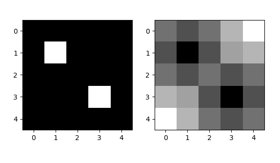

# smallpart-watershed
Script ini merupakan bagian kecil dari Watershed Transform, yaitu Euclidean Distance Transform.
Berfungsi untuk mengubah citra biner ke citra grayscale. Input merupakan array 2 dimensi yang berisi nilai pixel biner.

## Prerequisites
- Python 3
- Python library: matplotlib & numpy
